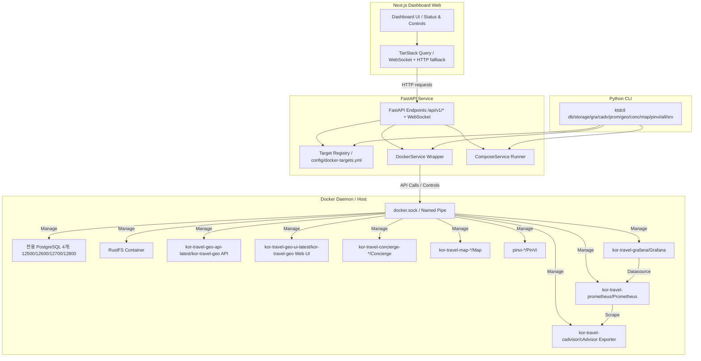

# ARCHITECTURE — Kor Travel Docker Manager 아키텍처

이 문서는 `kor-travel-docker-manager`의 시스템 아키텍처와 컴포넌트 간 데이터 흐름을 다룬다.

---

## 1. 개요

`kor-travel-docker-manager`는 Kor Travel/PinVi 계열 서비스를 구동하기 위한 프로젝트별 전용 PostgreSQL/PostGIS 4개, RustFS, `kor-travel-geo`, `kor-travel-concierge`, `kor-travel-map`, PinVi Docker 컨테이너의 구동 상태를 모니터링하고 제어하는 시스템이다.

```mermaid
graph TD
    subgraph Frontend [Next.js Dashboard Web]
        UI[Dashboard UI / Status & Controls]
        TQ[TanStack Query / WebSocket + HTTP fallback]
        UI --> TQ
    end

    subgraph Backend [FastAPI Service]
        API[FastAPI Endpoints /api/v1/* + WebSocket]
        REG[Target Registry / config/docker-targets.yml]
        DS[DockerService Wrapper]
        CS[ComposeService Runner]
        API --> REG
        API --> DS
        API --> CS
    end

    subgraph CLI [Python CLI]
        CLI_CMD[ktdctl db/storage/gra/cadv/prom/geo/conc/map/pinvi/all/srv]
        CLI_CMD --> REG
        CLI_CMD --> DS
        CLI_CMD --> CS
    end

    subgraph Infrastructure [Docker Daemon / Host]
        D_Sock[docker.sock / Named Pipe]
        C_PG[전용 PostgreSQL 4개: 12500/12600/12700/12800]
        C_RFS[RustFS Container]
        C_GEO_API[kor-travel-geo-api-latest/kor-travel-geo API]
        C_GEO_UI[kor-travel-geo-ui-latest/kor-travel-geo Web UI]
        C_CONC[kor-travel-concierge-*/Concierge]
        C_MAP[kor-travel-map-*/Map]
        C_PINVI[pinvi-*/PinVi]
        C_PROM[kor-travel-prometheus/Prometheus]
        C_GRAF[kor-travel-grafana/Grafana]
        C_EXP[kor-travel-cadvisor/cAdvisor Exporter]
        
        DS -->|API Calls / Controls| D_Sock
        D_Sock -->|Manage| C_PG
        D_Sock -->|Manage| C_RFS
        D_Sock -->|Manage| C_GEO_API
        D_Sock -->|Manage| C_GEO_UI
        D_Sock -->|Manage| C_CONC
        D_Sock -->|Manage| C_MAP
        D_Sock -->|Manage| C_PINVI
        D_Sock -->|Manage| C_PROM
        D_Sock -->|Manage| C_GRAF
        D_Sock -->|Manage| C_EXP
        C_PROM -->|Scrape| C_EXP
        C_GRAF -->|Datasource| C_PROM
    end
    
    TQ -->|HTTP requests| API
```

---

## 2. 백엔드 설계 (Python FastAPI)

백엔드는 가볍고 빠른 API 서빙을 위해 Python FastAPI를 채택한다. 로컬/원격 Docker 데몬과의 통신은 `docker` Python SDK를 사용한다.

### 2.1 Docker 데몬 연동 (`DockerService`)
- **연동 방식**: `docker.from_env()`를 호출하여 환경변수 및 기본 소켓 경로를 참조해 Docker 클라이언트를 초기화한다.
- **Windows 호스트**: 명명된 파이프 (`npipe:////./pipe/docker_engine`)를 통해 Docker Desktop 데몬과 통신한다.
- **Linux/WSL**: 유닉스 소켓 (`unix:///var/run/docker.sock`)을 통해 통신한다.
- **예외 처리**: Docker 데몬이 구동 중이지 않거나 권한이 없을 경우를 대비해, API 응답 시 503 Service Unavailable 및 정형화된 에러 객체를 반환하도록 설계한다.
- **사용 범위**: 컨테이너 상태, metrics, logs, inspect, 개별 action은 Docker SDK로 수행한다.

### 2.2 Compose 실행 (`ComposeService`)
- **역할**: 개발환경에서 의존 Docker를 앱 관점 target으로 실행한다.
- **실행 방식**: `docker compose`를 문자열 shell이 아닌 인자 배열로 실행한다.
- **지원 옵션**: `ensure`에서 `--build`, `--force-recreate`를 전달할 수 있다.
- **공유 target**: API와 Python CLI가 같은 registry(`db`, `storage`, `gra`, `cadv`, `prom`, `geo`, `conc`, `map`, `pinvi`, `all`)를 사용한다.
- **설정 파일**: target 정의, alias, 의존 순서, 초기화 단계는 `config/docker-targets.yml`에서 읽는다.
- **의존 순서**: 기본 결정적 순서는 `db -> storage -> gra -> cadv -> prom -> geo -> conc -> map -> pinvi`이며, 실제 실행 범위는 `depends_on` DAG의 전이 폐포를 위상정렬한다. `geo`와 `conc`는 서로 독립이고 `map`이 두 target 모두에 의존한다.
- **초기화 단계**: `db`는 Geo 전용 database/extension/schema grant를 복구하고, `storage`는 RustFS bucket을 복구하며, `geo`는 원천 DB 적재 상태를 검증한다. Concierge·PinVi database 생성은 각 Compose one-shot이, Map·PinVi schema bootstrap은 pinned rebuild workflow가 소유한다.
- **배포 readiness**: compatible-pair transaction에 고정된 canonical resolved Compose를 정본으로
  service별 readiness를 파생한다. 활성 healthcheck가 있으면 `running + healthy`, 없거나 명시적으로
  비활성화됐으면 `running`을 요구한다. `ps --all`의 service별 record는 정확히 하나여야 하고
  canonical scale/replica와 container name도 singleton으로 검증한다. 이름별 예외 목록이나 프로세스
  생존만 보는 가짜 probe는 두지 않는다.

### 2.3 API 엔드포인트 설계
- `POST /api/v1/auth/login`, `POST /api/v1/auth/logout`, `GET /api/v1/auth/me`: 관리자 세션 로그인, 로그아웃, 현재 사용자 확인.
- `GET /api/v1/targets`: 앱 관점 target 목록 반환.
- `POST /api/v1/targets/{target}/ensure`: target에 필요한 Docker 서비스를 실행. 개발환경에서는 `build=true`로 `docker compose up -d --build`를 수행.
- `GET /api/v1/containers`: 관리 대상 컨테이너의 상태, 포트, compose 설정, CPU/메모리/I/O 최신값 반환.
- `GET /api/v1/containers/{container_id}/inspect`: Docker inspect 핵심 정보를 secret redaction 후 반환.
- `POST /api/v1/containers/{container_id}/action`: 컨테이너 제어 명령 (`start`, `stop`, `restart`) 실행.
- `POST /api/v1/containers/{container_id}/config`: compose 파라미터 저장 후 컨테이너 재생성.
- `GET /api/v1/containers/{container_id}/logs`: 최근 100라인의 stdout/stderr 컨테이너 로그 반환.
- `POST /api/v1/containers/{container_id}/reset`: 허용된 개발 lifecycle에서 컨테이너 reset 실행.
- `GET /api/v1/containers/{container_id}/metrics`: 최근 CPU, 메모리, I/O 메트릭 이력 반환.
- `GET /metrics`: Prometheus text exposition format으로 관리 대상별 상태·healthcheck·재시작·종료 코드·시각·CPU·메모리·블록 I/O·네트워크·PID 관측값을 반환. 백그라운드 캐시만 읽으며 인증정보와 환경변수는 노출하지 않는다.
- `GET /api/v1/backups`: 전용 PostgreSQL backup 산출물의 읽기 전용 목록 반환.
- `GET /api/v1/admin/login-audit-events`, `GET/POST/DELETE /api/v1/admin/public-api-keys...`: 관리자 감사 및 public API key 관리.
- `/api/v1/ws/status`, `/api/v1/ws/logs/{container_id}`: 상태·로그 WebSocket 스트림.

`/api/v1` 아래의 관리자·컨테이너·백업·WebSocket 경로는 관리자 세션과 허용된 프론트엔드
Origin을 요구한다. 따라서 Origin이 없으면 먼저 `403`, 허용된 Origin이지만 세션이 없으면
`401`이 된다.

---

## 3. 프론트엔드 설계 (Next.js & React)

프론트엔드는 Next.js 14+ App Router를 기반으로 구성하며, 실시간 대시보드 성격의 단일 페이지 애플리케이션(SPA) 형태로 운영한다.

### 3.1 상태 관리 및 데이터 동기화
- **TanStack Query (React Query)**: 백엔드 API와의 통신 및 캐싱을 담당한다. 상태·로그는 WebSocket을 우선 사용하고 HTTP 폴링을 fallback으로 사용하며, 컨테이너 fallback 주기는 일반적으로 5초이고 shedding 중에는 30초다.
- **Zod & React Hook Form**: 컨테이너의 설정(예: 포트 번호, 환경변수, 데이터 볼륨 경로) 변경 양식을 안전하게 검증하고 전송한다.

### 3.2 UI/UX 디자인 시스템
- **관리 대시보드 우선**: 마케팅 hero나 장식 이미지를 배제하고, 상태 표·액션 버튼·상세 패널을 첫 화면의 중심에 둔다.
- **시각 양식**: 최신 `kor-travel-map` admin의 Rail-Workbench 구조와 밝은 표면, 얕은 그림자, 6px/10px radius를 따르되, 브랜드 색상은 기존 Ember 오렌지 토큰을 유지한다.
- **상태 인디케이터**: 컨테이너 상태는 색상 점, 텍스트, 아이콘을 함께 사용해 빠르게 스캔할 수 있게 한다.
- **상세 패널**: inspect, mounts, networks, redacted env, 최근 로그, 최근 메트릭을 한 화면에서 확인할 수 있게 확장하며, 리소스 탭에서 Docker stats의 누적값·델타·네트워크 인터페이스·PID를 구분한다.

---

## 4. 데이터베이스 및 파일 스토리지 (대상 인프라)

`kor-travel-docker-manager`가 관리하는 Docker 컨테이너 정의는 다음과 같다.

1. **프로젝트별 전용 PostgreSQL / PostGIS 4개** (ADR-37):
   - 컨테이너: `kor-travel-geo-postgres`
   - 이미지: `postgis/postgis:16-3.5`
   - 목적: Geo instance는 `kor_travel_geo`, `kor_travel_geo_dagster`만 보유한다. Concierge, Map, PinVi는 각각 별도 instance와 database를 사용한다.
   - 포트: `12500`(loopback 전용). host network라 `-p`가 곧 호스트 포트다.
   - DSN 형태: `postgresql+psycopg://<user>:<password>@127.0.0.1:12500/kor_travel_geo`. superuser
     password는 `POSTGRES_PASSWORD_FILE` secret으로 주고, `KOR_TRAVEL_GEO_DOCKER_PG_DSN`/
     `KOR_TRAVEL_GEO_DAGSTER_PG_URL`은 기본값 없이 fail-close로 요구한다(issue #178).
   - 나머지 셋은 `kor-travel-concierge-postgres`:12600 ·
     `kor-travel-map-postgres`:12700 · `pinvi-postgres`:12800이다.
   - PinVi의 `pinvi-postgres`와 `pinvi-db-init`은 다음 immutable PostGIS digest를 공유한다:
     `postgis/postgis@sha256:8b33190b6486ab9905dea999171817c1ac461733a7078dd4c836091c6e6b5d40`.
   - 기본 pgdata: `KOR_TRAVEL_GEO_PGDATA=/home/digitie/kor-travel-geo-data/pgdata-final-20260529`.
2. **RustFS**:
   - 컨테이너: `kor-travel-rustfs`
   - 이미지: `rustfs/rustfs:latest`
   - 목적: 미디어 자원과 `kor-travel-geo`, `kor-travel-concierge`, `kor-travel-map`, PinVi 원천·업로드 데이터 보관을 위한 공용 S3 호환 오브젝트 스토리지.
   - host 포트: `12101` (S3 API), `12105` (어드민 콘솔).
   - host 및 host-network 프로세스 listen 포트: `12101` (S3 API), `12105` (어드민 콘솔).
   - 개발용 Compose fallback credential: `RUSTFS_ACCESS_KEY=rustfsadmin`, `RUSTFS_SECRET_KEY=rustfsadmin`.
     운영에서는 반드시 루트 `.env`의 별도 값으로 덮어쓴다.
   - 기본 bucket: `pinvi-media`, `kor-travel-geo`, `kor-travel-concierge`, `krtour-map`, `krtour-uploads`.
3. **Grafana**:
   - 컨테이너: `kor-travel-grafana`
   - compose service: `grafana`
   - 목적: Prometheus datasource 기반 공용 메트릭 시각화.
   - host 포트: `12205`.
   - 컨테이너 내부 포트: `3000`.
4. **cAdvisor Exporter**:
   - 컨테이너: `kor-travel-cadvisor`
   - compose service: `cadvisor`
   - 목적: Docker 컨테이너 CPU, memory, filesystem, network 메트릭을 Prometheus 형식으로 노출.
   - `--docker_only=true`와 read-only Docker socket·`/sys`를 사용하며 host root·Docker data
     directory는 mount하지 않는다. 현재 Compose는 cAdvisor 수집기 호환성을 위해 `privileged: true`와
     `/dev/kmsg` device도 함께 선언한다.
   - Docker socket은 root:docker `0660`, `/sys`는 root-owned mountpoint 계약과 inode/device/mode 재검증을 통과해야 한다.
   - host 포트: `12301`.
   - host network에서 cAdvisor 프로세스는 `CADVISOR_PORT`(기본 `12301`)에 직접
     listen하며, Compose의 명시적 healthcheck도 같은 포트의 `/healthz`를 조회함.
     image에 상속된 기본 `8080` healthcheck에 의존하지 않음.
5. **Prometheus**:
   - 컨테이너: `kor-travel-prometheus`
   - compose service: `prometheus`
   - 목적: cAdvisor Exporter와 앱 메트릭 수집 및 저장.
   - host 포트: `12401`.
   - 컨테이너 내부 포트: `9090`.
6. **kor-travel-geo API**:
   - 컨테이너: `kor-travel-geo-api-latest`
   - compose service: `kor-travel-geo-api`
   - 목적: 지오코딩/리버스 지오코딩 REST API 제공.
   - host 포트: `12501`.
   - 컨테이너 내부 포트: `12501`.
   - 내부 의존성: `127.0.0.1:12500`(Geo 전용 PostgreSQL), `127.0.0.1:12101`(RustFS).
   - 기본 source data mount: `KOR_TRAVEL_GEO_APP_DATA_DIR=/mnt/f/dev/kor-travel-geo/data` -> `/data:ro`.
7. **kor-travel-geo Web UI**:
   - 컨테이너: `kor-travel-geo-ui-latest`
   - compose service: `kor-travel-geo-ui`
   - 목적: `kor-travel-geo` admin Web UI 제공.
   - host 포트: `12505`.
   - 컨테이너 내부 포트: `12505`.
   - 내부 API URL: `http://127.0.0.1:12501`.
8. **kor-travel-concierge API / MCP / Scheduler / Web UI**:
   - 컨테이너: `kor-travel-concierge-api-latest`, `kor-travel-concierge-mcp-latest`, `kor-travel-concierge-scheduler-latest`, `kor-travel-concierge-ui-latest`
   - compose service: `kor-travel-concierge-api`, `kor-travel-concierge-mcp`, `kor-travel-concierge-scheduler`, `kor-travel-concierge-ui`
   - 목적: 여행 concierge provider, MCP HTTP, scheduler, Web UI 제공.
   - host 포트: API `12601`, MCP `12602`, Web UI `12605`.
   - 내부 의존성: `127.0.0.1:12600`(Concierge 전용 PostgreSQL), `127.0.0.1:12101`(RustFS). Geo에는 의존하지 않는다.
9. **kor-travel-map 전용 PostgreSQL / API / Dagster / Web UI**:
   - DB 컨테이너: `kor-travel-map-postgres` (`127.0.0.1:12700`, Map application·Dagster metadata 전용).
   - 런타임 컨테이너: `kor-travel-map-api-latest`, `kor-travel-map-dagster-latest`, `kor-travel-map-dagster-daemon-latest`, `kor-travel-map-ui-latest`
   - compose service: `kor-travel-map-postgres`, `kor-travel-map-api`, `kor-travel-map-dagster`, `kor-travel-map-dagster-daemon`, `kor-travel-map-ui`
   - 목적: 지도 feature admin API, Dagster workflow, admin Web UI 제공.
   - host 포트: API `12701`, Dagster `12702`, Web UI `12705`.
   - 내부 의존성: 전용 PostgreSQL `127.0.0.1:12700`, RustFS `127.0.0.1:12101`, `kor-travel-geo-api:12501`, `kor-travel-concierge-api:12601`.
   - ADR-090 principal bootstrap은 dedicated DB만 대상으로 하는 F1D one-shot 단계다. normal Map runtime에는 bootstrap superuser DSN·role password를 주입하지 않는다.
10. **PinVi API / Dagster / Web UI**:
   - 컨테이너: `pinvi-api-latest`, `pinvi-dagster-latest`, `pinvi-web-latest`
   - compose service: `pinvi-api`, `pinvi-dagster`, `pinvi-web`
   - 목적: PinVi 서비스 API, Dagster workflow와 Web UI 제공.
   - host 포트: API `12801`, Dagster `12802`, Web UI `12805`.
   - Dagster image 계약: `DAGSTER_HOME=/opt/pinvi/.dagster`, code location
     `pinvi.etl.definitions`를 사용한다.
   - 내부 의존성: host network의 `127.0.0.1:12800`(PinVi 전용 PostgreSQL), `127.0.0.1:12101`,
     `127.0.0.1:${KOR_TRAVEL_MAP_API_CONTAINER_PORT:-12701}`.
   - worker 수: PinVi 실시간 WebSocket broadcast broker는 shared broker 도입 전까지 process-local이므로 `PINVI_API_WORKERS=1`을 기본값으로 둔다. worker를 2 이상으로 올리려면 PinVi 쪽 broadcast broker가 프로세스 간 전달을 지원해야 한다.
   - public URL/CORS: dev 기본값은 `http://127.0.0.1:12801`/로컬 Web origin이며, prod에서는 gitignore된 `.env`의 `PINVI_PUBLIC_API_URL`과 `PINVI_CORS_ALLOWED_ORIGINS`로 공개 API 주소와 Web origin을 주입한다.
   - C6c deployment lifecycle: `KTDM_DEPLOYMENT_ENVIRONMENT`와 `KTDM_DEPLOYMENT_LIFECYCLE`은 서로
     독립 flag가 아니라 typed pair다. `local/development`, `rehearsal/rebuildable`,
     `production/operational`만 유효하며 PinVi mode는 각각 `development`, `production`, `production`이고
     Map ops-principal-required는 각각 `false`, `true`, `true`여야 한다. 따라서 기존 production canonical
     env에 `rebuildable` 한 값만 추가해 destructive mutation을 열 수 없다. rebuildable에서는
     `rebuild-pinned --confirm` 외 managed runtime/DB mutation을 모두 거부한다.
   - C6c production: manager mode와 PinVi mode를 모두 `production`, Map의
     `KOR_TRAVEL_MAP_API_OPS_PRINCIPAL_REQUIRED`를 `true`로 명시한다. production의 일반
     `ensure`/container action·config·reset/direct Compose 경로는 일곱 runtime을 변경할 수 없고,
     host-wide lock을 잡는 `pinvi-pair` workflow만 generation이 같은 Map+PinVi runtime set을 단계 기동한다.
     transaction은 Map API·UI·Dagster web·Dagster daemon과 PinVi API·Web·Dagster를 하나의 immutable
     runtime generation으로 다룬다. Map API와 Dagster는 Map 저장소가 같은 exact commit/tree에서 봉인한
     application-300 paired candidate의 image ID를 사용하며 Dagster web·daemon은 같은 image ID를 공유한다.
     Manager가 Compose로 build하는 대상은 Map UI와 PinVi API·Web·Dagster 네 개다. Map API smoke 뒤 나머지
     Map runtime과 PinVi runtime을 exact image ID로 재생성하고, Map 네 runtime과 PinVi 세 runtime의 OCI
     revision 및 실제 container image를 generation과 다시 대조한다. manifest는 `PinnedRuntimeGeneration`
     v6, resume journal은 pinset별 v8이며, 일곱 immutable image ID, 두 clean source revision, paired receipt,
     application-300 contract, Map application/Dagster와 PinVi schema head를 active generation 하나에
     결박한다. 이전 pair version과 rollback slot은 수용하지 않는다. 완전한 수렴이 불가능하면 일곱
     runtime을 모두 중지해 혼합 generation 노출을 막는다.
     비운영 `KTDM_DEPLOYMENT_LIFECYCLE=rebuildable`에서 stale runtime/DB/state를 새 release pin으로
     수렴할 유일한 경로는 root execution의 `sudo -n /opt/kor-travel-docker-manager/backend/.venv/bin/ktdctl pinvi-pair rebuild-pinned --confirm`이다. 이 command는 trusted source와
     candidate resolved Compose security를 검증하고, 일곱 candidate image ID·세 expected schema head를
     durable하게 고정한 뒤 Map application·Map Dagster·PinVi database만 새로 만든다. Map application은
     과거 revision chain이나 restore를 사용하지 않고 paired contract의 head `300`을 root/finalize fence·intent·
     result와 application final permit으로 만든다. application DB와 Dagster metadata DB의 system identifier·
     name·OID·owner·login-role identity는 별도로 journal에 고정하며, metadata permit은 application identity와
     candidate Dagster image/config/paired receipt를 함께 결박한다. Map Dagster head는 source revision 추정값이
     아니라 candidate Dagster image가 직접 출력한 storage migration head다. storage migration은 journal
     transaction ID를 operation ID로 쓰는 DB intent+append-only receipt v2이며, durable intent 재개에서도
     같은 command가 receipt를 복구하거나 미완료 intent를 완결한다. operation ID·head·DB identity가
     다르면 fail-close한다. 이후 Dagster web·daemon은 `--no-deps`로 기동해 migration의 암묵적 재실행을
     막는다. PinVi
     migration+credential-file one-shot CLI도 별도 DB head를 exact 대조한다. F1J fixture smoke는 Map runtime·PinVi API ready 뒤 같은
     rebuild journal transaction ID로 실행하며, cancel/finalize POST 직전 attempted receipt를 fsync한다.
     응답 유실 재개는 Map immutable fixture receipt만 읽고 POST를 재발행하지 않는다. security·UI auth는
     그 contract verification 뒤 exact image에서 검증한다. old image, old manifest,
     old DB와 backup은 candidate 또는 rollback authority가 아니다. candidate 실패는 old runtime 복원 대신
     일곱 runtime 중지로 fail-close한다. canonical `.env`의 source checkout과 release-bound runtime contract 갱신은 별도 trusted
     pinned deployment input transaction이 소유한다. 이 installer는 user-owned checkout의 Git config를 root에서
     실행하지 않고 source-owner의 read-only origin identity와 code-owned canonical HTTPS URL을 exact 대조한다.
     root-owned bare staging repo가 tracked full SHA 하나만 sanitized fetch해 immutable detached worktree를
     만든다. source-root·revision scalar와 Map migration expected head·PinVi cache-target contract scalar를
     하나의 atomic env keyset으로 교체한다. prior terminal input receipt와 canonical env가 exact predecessor
     pinset임을 검증한 rotation preflight만 old→new input 교체를 허용한다. private old-env backup과 durable
     journal은 `pinned-deployment-inputs-v2/history/<pinset_sha256>/`의 불변 세대로 남겨
     future re-pin이 성공 receipt나 backup을 덮지 못하게 한다. legacy F1D/F1F receipt는 typed tombstone으로
     폐기할 뿐 rebuild/rotation의 predecessor authority가 아니다. installer 자체는 Docker·Compose·DB·runtime·
     image build를 호출하지 않는다.
   - Map production API 인증은 ADR-23의 exact runtime 경계를 따른다. admin proxy secret은
     Map API와 UI BFF에만 공유하고 service token·cursor signing secret은 Map API에만 둔다.
     production profile/public-key-required/debug-off는 literal로 고정하며, 인증된 Prometheus
     scrape 결선 전에는 Map metrics endpoint를 명시적으로 비활성화한다. host network의 admin
     proxy 신뢰 범위는 loopback `127.0.0.1/32`·`::1/128` exact JSON으로 고정한다. raw/resolved/runtime
     preflight는 이 결선과 credential 상호 구분을 candidate mutation 전에 검사한다.
   - Manager mutation의 compose source는 단일 canonical 파일이다. mutex 안에서 persisted/request의
     raw·Docker-resolved volume graph를 각각 exact 비교하고 include/extends/override 합성을 거부한다.
     cAdvisor mount는 RO `/sys`와 Docker socket exact set만 허용한다. 첫 mutation 성공 뒤 후속 preflight
     drift가 발생하면 원래 오류를 보존한 typed 500과 함께 compose/runtime 복구 결과를 반환한다.

`kor-travel-geo`, `kor-travel-concierge`, `kor-travel-map`, PinVi는 더 이상 자체 저장소의 Docker compose 또는 RustFS 구동 스크립트로 PostgreSQL/RustFS 생명주기를 직접 관리하지 않는다. `geo`, `conc`, `map`, `pinvi` target은 각 앱 컨테이너를 manager에서 함께 빌드하고 실행한다. 로컬에서 해당 인프라를 실행하거나 재시작할 때는 이 저장소의 `ktdctl` CLI, 대시보드/API를 사용한다. 공식 CLI target은 `db`, `storage`, `gra`, `cadv`, `prom`, `geo`, `conc`, `map`, `pinvi`이며, `srv`와 `main`은 `pinvi`를 가리키는 별칭이다. `config/docker-targets.yml`에서 순서와 포함 서비스를 확장한다.

로컬 host 포트 정책은 `docs/ports.md`를 기준으로 한다. PostgreSQL은 프로젝트마다 전용 instance이고 포트는 각 대역의 `x00`이다 — geo `12500`, concierge `12600`, map `12700`, pinvi `12800`(ADR-37). 넷 다 loopback 전용이고 `5432`를 듣는 것은 없다. RustFS는 `storage` 대역(`12100-12199`), Grafana는 `gra` 대역(`12200-12299`), cAdvisor는 `cadv` 대역(`12300-12399`), Prometheus는 `prom` 대역(`12400-12499`), `kor-travel-geo`는 `geo` 대역(`12500-12599`), `kor-travel-concierge`는 `conc` 대역(`12600-12699`), `kor-travel-map`은 `map` 대역(`12700-12799`), PinVi는 `pinvi` 대역(`12800-12899`), `kor-travel-docker-manager` 자체 API/Web은 `12900-12999` 대역을 사용한다.
